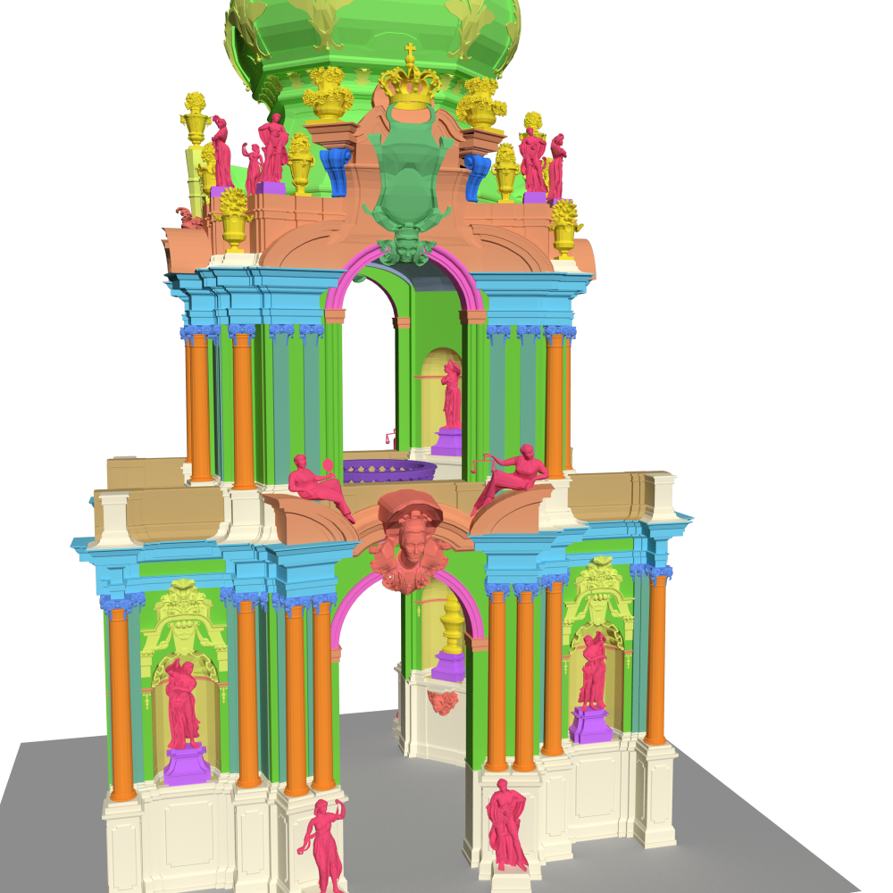

# 3D Models

In the provided 3D models, most of the architectural elements are separate objects that were labeled with respective AAT or Wikidata ids following the pattern `<englishName>_wd:<wikidataId>_aat:<aatId>_<number>`, (e.g. `arch_wd:Q12277_aat:300000994_003`) which allows parsing the identifiers of the AAT and Wikidata.
Some objects are grouped to form a more general entity resulting in a hierarchy of elements.

The 3D models are provided as FBX and XML-based Collada file.
Due to their size, the files are provided via a separate file hosting service. 

Available 3D models:

- [kronentor.zip](https://drive.google.com/file/d/1WAT_mD6gpkzZ3xDzPHj-z1Bo6-Ygv-0-/)