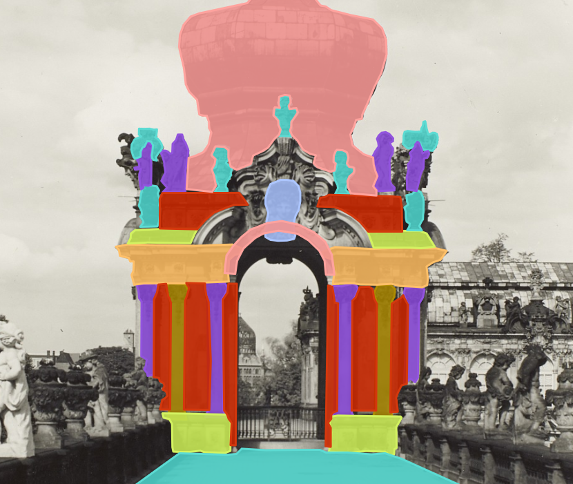
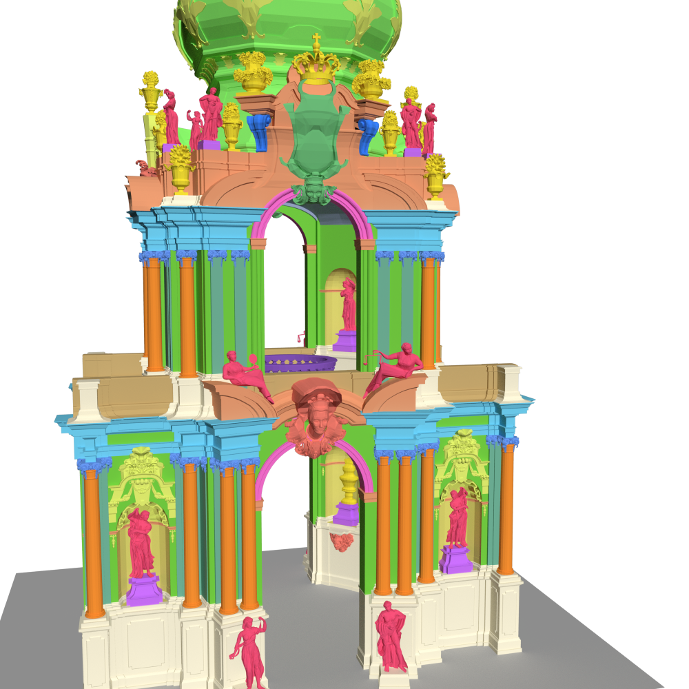

# ArchiLabel &ndash; A Multimodal Dataset for the Research of Architectural Elements

_work in progress_

This multimodal dataset contains images, textual resources, and 3D models of a small urban area.
The goal is to improve art historical research on architectural elements relying on the three data entities.
To this end, the entities have been annotated with labels using identifiers of controlled vocabularies (Wikidata and Getty Art & Architecture Thesaurus (AAT)) referring to the architectural elements.

 

Citation:

```bibtex
@article{ArchiLabel2023,
    author = {Bruschke, J. and Kröber, C. and Maiwald, F. and Utescher, R. and Pattee, A.},
    title = {Introducing a Multimodal Dataset for the Research of Architectural Elements},
    journal = {journal},
    year = {2023},
}
```
