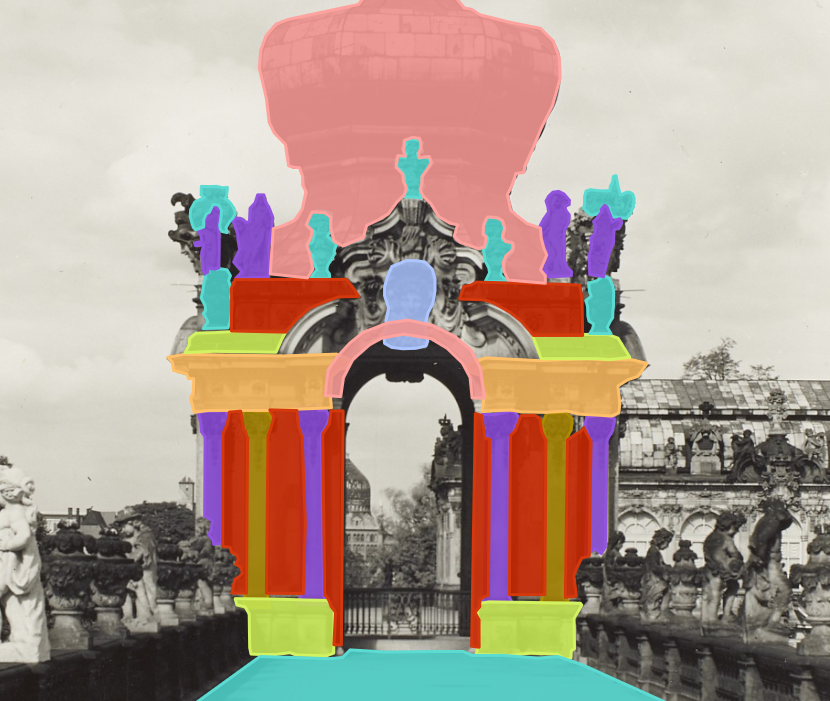

# Images

 

The images have been manually segmented and labeled using [Label Studio](https://labelstud.io/), a multi-type data labeling and annotation tool with standardized output format.
Each annotation follows a naming convention incorporating both AAT and Wikidata ids:
`<englishName>_wd:<wikidataId>_aat:<aatId>` (e.g. `arch_wd:Q12277_aat:300000994`).
The images are provided together with a JSON file following the [COCO data segmentation format](https://cocodataset.org/#format-data).

The images have been retrieved from the [Deutsche Fotothek](https://www.deutschefotothek.de/) and are licensed under Creative Commons and Public Domain.